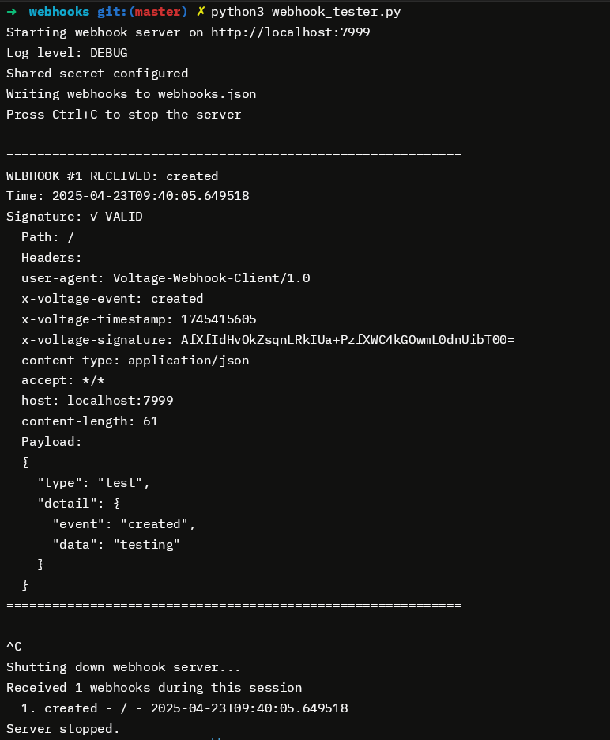

# Webhook Tester

A simple Python-based webhook receiver for testing and debugging webhook integrations.

## Overview

Webhook Tester is a lightweight HTTP server that listens for incoming webhook requests, displays their contents, verifies signatures, and saves the received data for analysis. It's designed for testing webhook integrations during development and debugging.

## Features

- **Easy Setup**: Simple Python script with no external dependencies
- **Real-time Display**: View incoming webhook payloads, headers, and metadata in real-time
- **Signature Verification**: Verify webhook signatures using HMAC-SHA256
- **Data Export**: Save received webhooks to a JSON file for later analysis
- **Configurable**: Set host, port, logging level, and shared secret via configuration file

## Requirements

- Python 3.6 or higher

## Installation

No installation is required. Simply download the `webhook_tester.py` script to your machine.

```bash
# Make the script executable (Unix-like systems)
chmod +x webhook_tester.py
```

## Usage

### Basic Usage

Start the webhook receiver with default settings:

```bash
python webhook_tester.py
```

This will:
- Start the server on `localhost:7999`
- Save received webhooks to `webhooks.json`
- Use INFO level logging

### Example output:


### Configuration File

The script uses a JSON configuration file (default: `webhook_config.json`). If the file doesn't exist, a default one will be created automatically with these settings:

```json
{
  "host": "localhost",
  "port": 7999,
  "secret": null,
  "output_file": "webhooks.json",
  "truncate_output": false,
  "log_level": "INFO"
}
```

You can customize:
- `host`: Host address to bind to
- `port`: Port to listen on
- `secret`: Shared secret for signature verification
- `output_file`: Path to save received webhooks
- `truncate_output`: Whether to clear the output file on startup
- `log_level`: Logging level (INFO, DEBUG, ERROR)

### Using a Custom Configuration

```bash
python webhook_tester.py --config my_custom_config.json
```

### Using with External Services

To receive webhooks from external services, you'll need to expose your local server to the internet. You can use a tool like [localtunnel](https://theboroer.github.io/localtunnel-www/):

```bash
# Install localtunnel if you haven't already
npm install -g localtunnel

# Then expose your webhook tester
lt --port 7999
```

Use the URL provided by localtunnel as your webhook endpoint in the external service.

## Signature Verification

The webhook tester supports signature verification using HMAC-SHA256. To verify signatures:

1. Add a `secret` value in your configuration file
2. Ensure your webhook source is sending the following headers:
   - `x-voltage-signature`: Base64-encoded HMAC-SHA256 signature
   - `x-voltage-timestamp`: Timestamp used in the signature calculation

The signature is calculated as:
```
HMAC-SHA256(shared_secret, payload_string + "." + timestamp)
```

## Reading Webhook Data

When a webhook is received, the following information is displayed:

- Webhook number and event type
- Timestamp when the webhook was received
- Signature verification result (if a secret is configured)

In DEBUG mode, additional information is shown:
- Request path
- All request headers
- Full JSON payload

## Saving Webhook Data

Received webhooks are automatically saved to the configured output file in JSON format. Each webhook entry includes:
- Timestamp
- Path
- Headers
- Payload
- Signature details
- Event type

When you stop the webhook tester (by pressing Ctrl+C), you'll see a summary of all received webhooks during that session.

## Troubleshooting

- **Need more detailed information**: Set `log_level` to `"DEBUG"` in your configuration
- **Signature verification fails**: Check that the shared secret matches between sender and receiver
- **Can't receive external webhooks**: Ensure your server is accessible from the internet (e.g., using localtunnel)
- **JSON parsing errors**: Ensure the webhook payload is valid JSON
- **Need to start fresh**: Set `truncate_output` to `true` in your configuration
