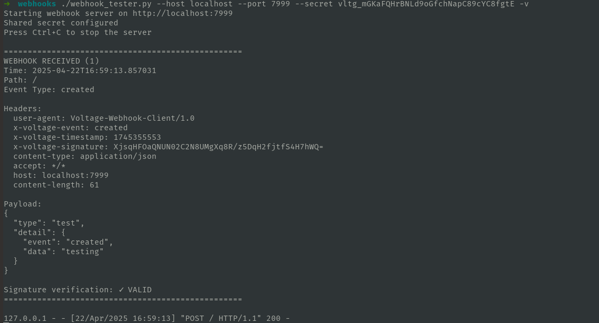

# Webhook Tester

A simple Python-based webhook receiver for testing and debugging webhook integrations.

## Overview

Webhook Tester is a lightweight HTTP server that listens for incoming webhook requests, displays their contents, verifies signatures, and saves the received data for analysis. It's designed for testing webhook integrations during development and debugging.

## Features

- **Easy Setup**: Simple Python script with no external dependencies
- **Real-time Display**: View incoming webhook payloads, headers, and metadata in real-time
- **Signature Verification**: Verify webhook signatures using HMAC-SHA256
- **Data Export**: Save received webhooks to a JSON file for later analysis
- **Customizable**: Configure host, port, and shared secret via command-line options

## Requirements

- Python 3.6 or higher

## Installation

No installation is required. Simply download the `webhook_tester.py` script to your machine.

```bash
# Make the script executable (Unix-like systems)
chmod +x webhook_tester.py
```

## Usage

### Basic Usage

Start the webhook receiver on the default port (8000):

```bash
python webhook_tester.py
```

### Command-line Options

```bash
python webhook_tester.py [OPTIONS]
```

Available options:

- `--host HOST`: Host address to bind to (default: localhost)
- `--port PORT`: Port to listen on (default: 8000)
- `--secret SECRET`: Shared secret for signature verification
- `--verbose, -v`: Enable verbose output (shows detailed webhook information)

### Examples

Listen on port 9000:
```bash
python webhook_tester.py --port 9000
```

Listen on all interfaces:
```bash
python webhook_tester.py --host 0.0.0.0
```

Configure a shared secret for signature verification:
```bash
python webhook_tester.py --secret your_webhook_shared_secret
```

### Using with External Services

To receive webhooks from external services, you'll need to expose your local server to the internet. You can use a tool like [ngrok](https://ngrok.com/):

```bash
# Install ngrok if you haven't already
# Then expose your webhook tester
ngrok http 8000
```

Use the URL provided by ngrok as your webhook endpoint in the external service.

## Signature Verification

The webhook tester supports signature verification using HMAC-SHA256. To verify signatures:

1. Start the tester with the `--secret` option
2. Ensure your webhook source is sending the following headers:
   - `x-voltage-signature`: Base64-encoded HMAC-SHA256 signature
   - `x-voltage-timestamp`: Timestamp used in the signature calculation

The signature is calculated as:
```
HMAC-SHA256(shared_secret, payload_string + "." + timestamp)
```

## Reading Webhook Data

When a webhook is received, the following information is displayed (if verbose mode is enabled):

- Timestamp when the webhook was received
- Request path
- Event type (from the `x-voltage-event` header)
- All request headers
- Full JSON payload
- Signature verification result (if applicable)

## Saving Webhook Data

When you stop the webhook tester (by pressing Ctrl+C), you'll see a summary of all received webhooks and be prompted to save them to a JSON file. This file can be used for later analysis or debugging.

## Example Output




## Troubleshooting

- **No webhooks being displayed**: Make sure verbose mode is enabled
- **Signature verification fails**: Check that the shared secret matches between sender and receiver
- **Can't receive external webhooks**: Ensure your server is accessible from the internet (e.g., using ngrok)
- **JSON parsing errors**: Ensure the webhook payload is valid JSON
